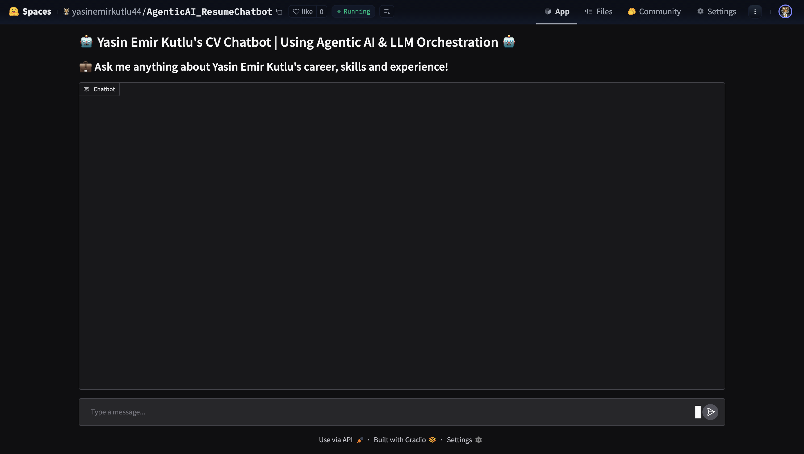
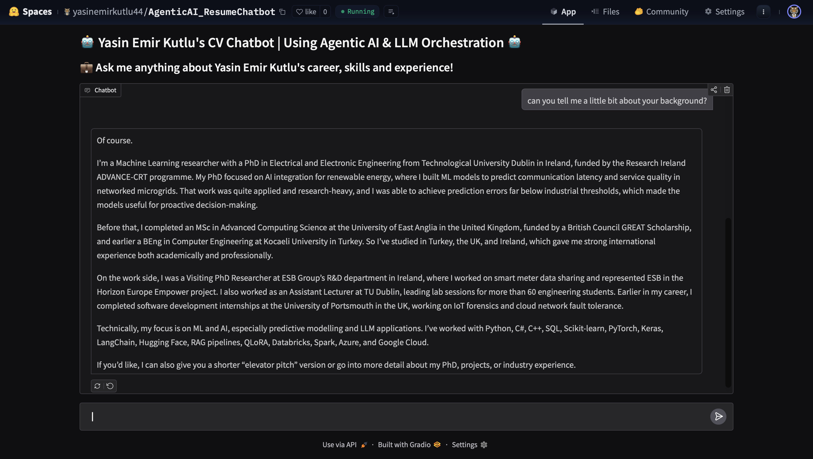
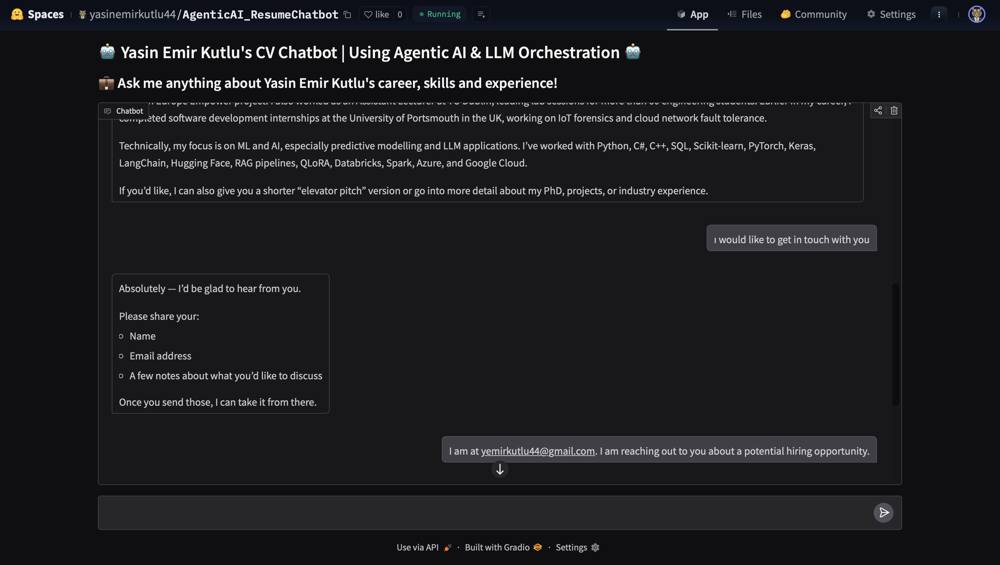
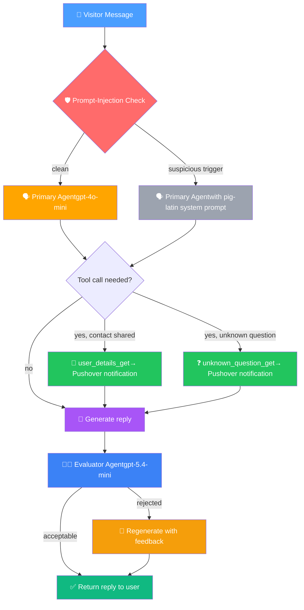

# 🗣️ Agentic AI Resume Chatbot 💼

An interactive chatbot that answers questions about my career, skills and experience on my behalf — powered by an **evaluator–optimiser LLM workflow**, real-time Pushover notifications, and tool-calling agents.

🚀 **Live demo:** [Hugging Face Space](https://huggingface.co/spaces/yasinemirkutlu44/AgenticAI_ResumeChatbot)

Ask about my background, get a professional answer → if the tone isn't right, a second model evaluates the response and the first model regenerates it based on that feedback.

---

## ✨ What It Does

Visitors can ask anything about my professional profile — education, skills, PhD research, projects, work experience — and the chatbot responds on my behalf. Under the hood:

1. **Answer** questions using my CV (PDF) and a curated summary as grounding context.
2. **Evaluate** each answer with a separate LLM acting as a quality reviewer — rejecting responses that drift off-tone or off-topic.
3. **Regenerate** rejected responses using the evaluator's feedback, closing the loop.
4. **Capture visitors and inquries** —> when a visitor shares an email, the chatbot calls a tool to record the contact via a Pushover notification.
5. **Log gaps** —> if a question falls outside the grounding context, the chatbot records it as an unknown question for later review.

---

## 📸 Screenshots

### Home screen
The chatbot welcomes visitors and invites them to ask about my career.


### Grounded conversational response
Answers are drawn from the CV and summary — specific, factual, and in my voice.


### Potential Employer capture in action
When a visitor shares their email, the chatbot collects their name, email, and notes.


### Real-time Pushover notification: Employer got in touch
A tool call fires as soon as the visitor's email is shared, delivering their details straight to my phone.


### Real-time Pushover notification — unknown question
Questions outside the CV (e.g. hobbies) are logged so I can review and expand the knowledge base.


---

## 🤖 Agent Architecture

The chatbot uses an **evaluator–optimiser** pattern: one model generates, another critiques, and rejected responses are regenerated with explicit feedback. Two tools handle side effects (notifications), keeping the conversational logic clean.

| Component | Role | Model / Output |
|-----------|------|----------------|
| 🗣️ **Primary Agent** | Answers user questions in a professional, approachable tone, grounded in the CV (PDF) and summary text. Can invoke tools when the user shares contact details or asks something outside its knowledge. | `gpt-4o-mini` |
| 🧑‍⚖️ **Evaluator Agent** | Reviews each response against the conversation context and reference material. Decides whether the response meets the quality bar and provides structured feedback. | `gpt-5.4-mini` with Pydantic `ChatMessage_Evaluation` output |
| 📝 **`user_details_get` Tool** | Records a visitor's email, name, and notes when they express interest in getting in touch. Triggers a real-time Pushover notification. | Function tool |
| ❓ **`unknown_question_get` Tool** | Logs questions that fall outside the CV/summary so they can be reviewed and addressed later. | Function tool |
| 🛡️ **Prompt-Injection Guard** | Detects trigger words in user messages that attempt to steer the conversation off-topic and switches the response style defensively. | Heuristic check before model call |

All logic lives in the **`Person`** class, which loads the grounding documents, assembles the system prompt, routes tool calls, and orchestrates the evaluator loop.

---

## 🔄 How It Works



The evaluator–optimiser loop ensures each response clears a quality bar before reaching the visitor, and the tool-calling layer quietly captures leads and gaps without interrupting the conversation.

---

## 💻 Running Locally

**1. Clone the repo**

```bash
git clone https://github.com/yasinemirkutlu44/<AgenticAI_LLMOrchestration_CVChatbot>.git
cd <AgenticAI_LLMOrchestration_CVChatbot>
```

**2. Install dependencies**

```bash
pip install -r requirements.txt
```

**3. Set your environment variables**

Create a `.env` file in the project root:

```
OPENAI_API_KEY=sk-...
PUSHOVER_USER_ID=your-pushover-user-id
PUSHOVER_APP_API=your-pushover-app-token
```

Pushover credentials are used for real-time notifications when visitors share contact details or ask unknown questions. Sign up at [pushover.net](https://pushover.net/) if you don't have an account.

**4. Add your grounding material**

Place your CV PDF and summary text file in the project root (or update the paths in `AgenticAI_CVChatbot.py`).

**5. Launch the app**

```bash
python AgenticAI_CVChatbot.py
```

The Gradio UI opens in your browser.

---

## 🎯 Design Highlights

- **Evaluator–optimiser loop** — instead of trusting a single LLM pass, responses are reviewed by a second model and regenerated when they don't meet the quality bar. This catches drift, off-tone replies, and hallucinations that single-pass systems often miss.
- **Grounded in real documents** — the primary agent's system prompt includes both a PDF-extracted CV and a curated summary, so answers stay factual rather than generic.
- **Tool calls for side effects** — contact capture and unknown-question logging live in tools, keeping the conversational model focused on conversation and pushing integration work (Pushover HTTP calls) out of the LLM layer.
- **Structured evaluator output** — the evaluator returns a Pydantic `ChatMessage_Evaluation` object (`is_response_acceptable` + `feedback`) via the OpenAI structured-output API, eliminating fragile text parsing.
- **Lightweight prompt-injection guard** — trigger-word checks on incoming messages switch the bot into a defensive mode for off-topic probing attempts, showing that visitor input isn't blindly trusted.

---

## 📌 Why This Pattern Matters

Evaluator–optimiser workflows are a practical way to improve LLM response quality without fine-tuning. One model writes the response and another reviews it. If the review fails, the first model tries again with the feedback. This project shows the pattern in a small, self-contained app.

---

## 🛠️ Possible Extensions

- Swap Pushover for Slack or email notifications
- Persist evaluator feedback to a log for later analysis
- Add a second evaluator pass focused on factual accuracy against the CV
- Replace the trigger-word guard with a dedicated LLM-based injection detector
- Multi-turn evaluation (score the whole conversation, not just the latest reply)

---

## 📜 License

MIT — feel free to fork, adapt, and build on top of this.

---

💬 **Built with OpenAI frontier models, Pushover, and Gradio** 🚀
